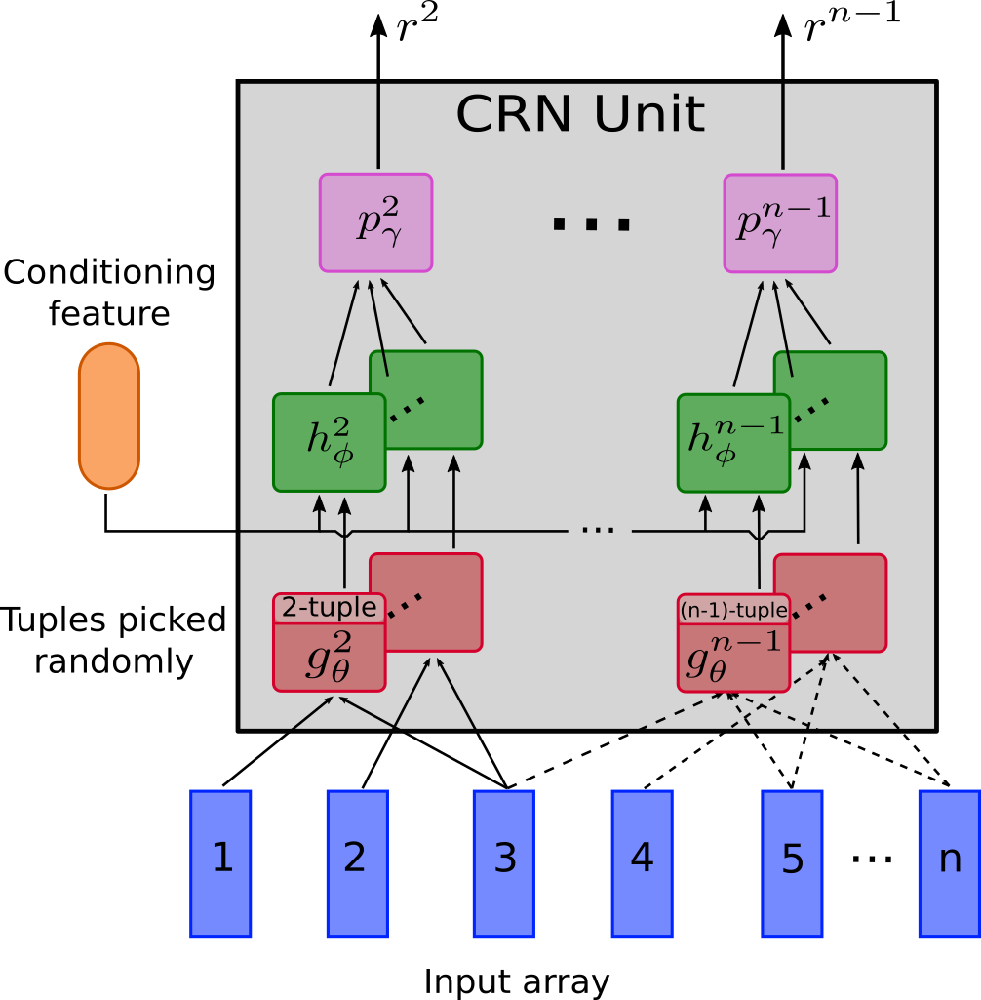
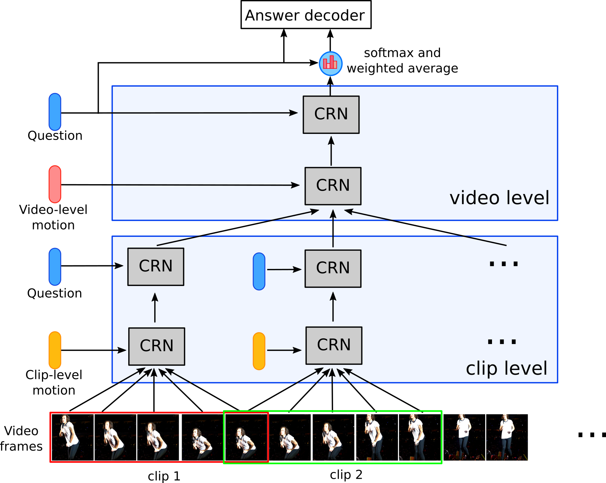

# Hierarchical Conditional Relation Networks for Video Question Answering (HCRN-VideoQA)

We introduce a general-purpose reusable neural unit called Conditional Relation Network (CRN) that encapsulates and transforms an array of tensorial objects into a new array of the same kind, conditioned on a contextual feature. The flexibility of CRN units is then examined in solving Video Question Answering, a challenging problem requiring joint comprehension of video content and natural language processing.

Illustrations of CRN unit and the result of model building HCNR for VideoQA:

CRN Unit             |  HCRN Architecture
:-------------------------:|:-------------------------:
  |  

Check out our [paper](https://arxiv.org/abs/2002.10698) for details.

## Setups
1. Clone the repository:
```
 git clone https://github.com/thaolmk54/hcrn-videoqa.git
```

2. Download [TGIF-QA](https://github.com/YunseokJANG/tgif-qa), [MSRVTT-QA, MSVD-QA](https://github.com/xudejing/video-question-answering) dataset and edit absolute paths in `preprocess/preprocess_features.py` and `preprocess/preprocess_questions.py` upon where you locate your data. Default paths are with `/ceph-g/lethao/datasets/{dataset_name}/`.

3. Install dependencies:
```bash
conda create -n hcrn_videoqa python=3.6
conda activate hcrn_videoqa
conda install -c conda-forge ffmpeg
conda install -c conda-forge scikit-video
pip install -r requirements.txt
```

## Experiments with TGIF-QA
Depending on the task to chose `question_type` out of 4 options: `action, transition, count, frameqa`.
#### Preprocessing visual features
1. To extract appearance feature:

```
python preprocess/preprocess_features.py --gpu_id 2 --dataset tgif-qa --model resnet101 --question_type {question_type}
```
    
2. To extract motion feature:

    Download ResNeXt-101 [pretrained model](https://drive.google.com/drive/folders/1zvl89AgFAApbH0At-gMuZSeQB_LpNP-M) (resnext-101-kinetics.pth) and place it to `data/preprocess/pretrained/`.

```
python preprocess/preprocess_features.py --dataset tgif-qa --model resnext101 --image_height 112 --image_width 112 --question_type {question_type}
```

**Note**: Extracting visual feature takes a long time. You can download our pre-extracted features from [here](https://bit.ly/2TX9rlZ) and save them in `data/tgif-qa/{question_type}/`. Please use the following command to join split files:

```
cat tgif-qa_{question_type}_appearance_feat.h5.part* > tgif-qa_{question_type}_appearance_feat.h5
```

#### Proprocess linguistic features
1. Download [glove pretrained 300d word vectors](http://nlp.stanford.edu/data/glove.840B.300d.zip) to `data/glove/` and process it into a pickle file:

 ```
 python txt2pickle.py
```
2. Preprocess train/val/test questions:
```
python preprocess/preprocess_questions.py --dataset tgif-qa --question_type {question_type} --glove_pt data/glove/glove.840.300d.pkl --mode train
    
python preprocess/preprocess_questions.py --dataset tgif-qa --question_type {question_type} --mode test
```      
#### Training
Choose a suitable config file in `configs/{task}.yml` for one of 4 tasks: `action, transition, count, frameqa` to train the model. For example, to train with action task, run the following command:
```bash
python train.py --cfg configs/tgif_qa_action.yml
```

#### Evaluation
To evaluate the trained model, run the following:
```bash
python validate.py --cfg configs/tgif_qa_action.yml
```
**Note**: Pretrained model for action task is available [here](https://drive.google.com/open?id=1xzD4JbuoFYAgJG41eAwBo77i3oVrbKyg). Save the file in `results/expTGIF-QAAction/ckpt/` for evaluation.
## Experiments with MSRVTT-QA and MSVD-QA
The following is to run experiments with MSRVTT-QA dataset, replace `msrvtt-qa` with `msvd-qa` to run with MSVD-QA dataset.
#### Preprocessing visual features
1. To extract appearance feature:
```
python preprocess/preprocess_features.py --gpu_id 2 --dataset msrvtt-qa --model resnet101
``` 
2. To extract motion feature:
```
python preprocess/preprocess_features.py --dataset msrvtt-qa --model resnext101 --image_height 112 --image_width 112
```

#### Proprocess linguistic features
Preprocess train/val/test questions:
```
python preprocess/preprocess_questions.py --dataset msrvtt-qa --glove_pt data/glove/glove.840.300d.pkl --mode train
    
python preprocess/preprocess_questions.py --dataset msrvtt-qa --question_type {question_type} --mode val
    
python preprocess/preprocess_questions.py --dataset msrvtt-qa --question_type {question_type} --mode test
```

#### Training
```bash
python train.py --cfg configs/msrvtt_qa.yml
```

#### Evaluation
To evaluate the trained model, run the following:
```bash
python validate.py --cfg configs/msrvtt_qa.yml
```
## Citations
If you make use of this repository for your research, please cite the following paper:
```
@article{le2020hierarchical,
  title={Hierarchical Conditional Relation Networks for Video Question Answering},
  author={Le, Thao Minh and Le, Vuong and Venkatesh, Svetha and Tran, Truyen},
  journal={arXiv preprint arXiv:2002.10698},
  year={2020}
}
```
## Acknowledgement
- As for motion feature extraction, we adapt ResNeXt-101 model from this [repo](https://github.com/kenshohara/video-classification-3d-cnn-pytorch) to our code. Thank @kenshohara for releasing the code and the pretrained models. 
- We refer to this [repo](https://github.com/facebookresearch/clevr-iep) for preprocessing.
- Our implementation of dataloader is based on this [repo](https://github.com/shijx12/XNM-Net).
